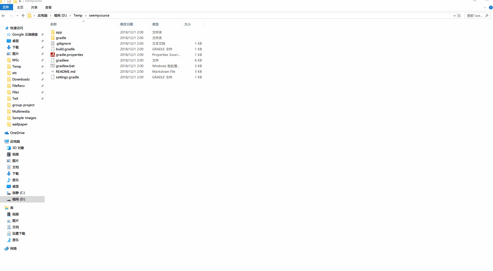

 


# See My Course

    


## Get Started

- Open Android Studio
- Open **this project** from Android Studio
- Launch your own Virtual Device or Android Phone
- Click the **Green Arrow Button** to run this App

Gif Step by Step ↓




## Snapshots


## App Structure

```json
MainActivity
  |
  |———— TodoListFragment
  |———— RecognitionFragment
          |———— MetaText
          |———— TemplateSelectActivity
          |———— PuzzleActivity
                  |———— Puzzle
		          |———— BitmapPiece
  |———— ProductionFragment
  |———— Util
```


